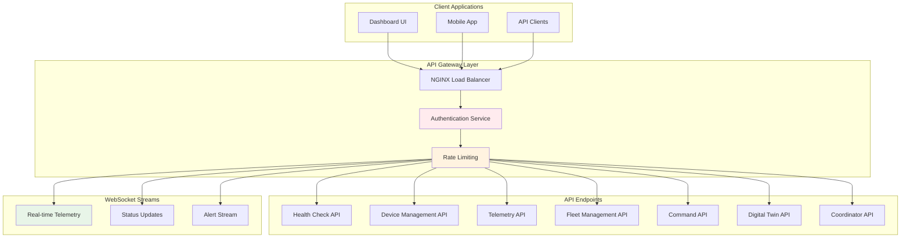

# PulseBMS Enhanced - API Specifications

## REST API Architecture



## API Endpoint Specifications

### Health Check API

```yaml
# GET /api/v1/health
responses:
  200:
    description: System health status
    content:
      application/json:
        schema:
          type: object
          properties:
            status:
              type: string
              enum: [healthy, degraded, unhealthy]
            version:
              type: string
              example: "1.0.0"
            timestamp:
              type: string
              format: date-time
            uptime_seconds:
              type: number
            services:
              type: object
              properties:
                database:
                  type: string
                  enum: [healthy, unhealthy]
                mqtt:
                  type: string
                  enum: [healthy, unhealthy]
                redis:
                  type: string
                  enum: [healthy, unhealthy]
                digital_twin:
                  type: string
                  enum: [healthy, unhealthy]
            metrics:
              type: object
              properties:
                active_devices:
                  type: integer
                messages_per_second:
                  type: number
                response_time_ms:
                  type: number
                error_rate:
                  type: number
        example:
          status: "healthy"
          version: "1.0.0"
          timestamp: "2024-01-15T14:30:00Z"
          uptime_seconds: 86400
          services:
            database: "healthy"
            mqtt: "healthy"
            redis: "healthy"
            digital_twin: "healthy"
          metrics:
            active_devices: 147
            messages_per_second: 234.5
            response_time_ms: 12.3
            error_rate: 0.001
```

### Device Management API

```yaml
# GET /api/v1/devices/{device_id}
parameters:
  - name: device_id
    in: path
    required: true
    schema:
      type: string
responses:
  200:
    description: Device configuration and status
    content:
      application/json:
        schema:
          type: object
          properties:
            device_id:
              type: string
            site_id:
              type: string
            name:
              type: string
            chemistry:
              type: string
              enum: [LFP, NMC, LCO, NCA]
            specifications:
              type: object
              properties:
                nominal_capacity:
                  type: number
                  description: "Capacity in Ah"
                nominal_voltage:
                  type: number
                  description: "Voltage in V"
                max_charge_power:
                  type: number
                  description: "Power in W"
                max_discharge_power:
                  type: number
                  description: "Power in W"
                series_cells:
                  type: integer
                parallel_cells:
                  type: integer
            current_status:
              type: object
              properties:
                status:
                  type: string
                  enum: [online, offline, error, maintenance]
                last_seen:
                  type: string
                  format: date-time
                current_soc:
                  type: number
                  minimum: 0
                  maximum: 100
                current_soh:
                  type: number
                  minimum: 0
                  maximum: 100
                active_alarms:
                  type: array
                  items:
                    type: string
            safety_constraints:
              type: object
              properties:
                max_cell_voltage:
                  type: number
                min_cell_voltage:
                  type: number
                max_charge_current:
                  type: number
                max_discharge_current:
                  type: number
                temperature_limits:
                  type: object
                  properties:
                    max:
                      type: number
                    min:
                      type: number

# POST /api/v1/devices
requestBody:
  required: true
  content:
    application/json:
      schema:
        type: object
        required: [device_id, site_id, name, chemistry, specifications]
        properties:
          device_id:
            type: string
            pattern: '^[a-zA-Z0-9_-]+$'
          site_id:
            type: string
          name:
            type: string
            minLength: 1
            maxLength: 255
          chemistry:
            type: string
            enum: [LFP, NMC, LCO, NCA]
          specifications:
            type: object
            required: [nominal_capacity, nominal_voltage, series_cells, parallel_cells]
            properties:
              nominal_capacity:
                type: number
                minimum: 0.1
                maximum: 10000
              nominal_voltage:
                type: number
                minimum: 1
                maximum: 1000
responses:
  201:
    description: Device created successfully
  400:
    description: Invalid device configuration
  409:
    description: Device already exists
```

### Telemetry API

```yaml
# GET /api/v1/telemetry/{device_id}
parameters:
  - name: device_id
    in: path
    required: true
    schema:
      type: string
  - name: start_time
    in: query
    schema:
      type: string
      format: date-time
  - name: end_time
    in: query
    schema:
      type: string
      format: date-time
  - name: resolution
    in: query
    schema:
      type: string
      enum: [raw, minute, hour, day]
      default: hour
  - name: metrics
    in: query
    schema:
      type: array
      items:
        type: string
        enum: [voltage, current, power, temperature, soc, soh]
responses:
  200:
    description: Telemetry data
    content:
      application/json:
        schema:
          type: object
          properties:
            device_id:
              type: string
            start_time:
              type: string
              format: date-time
            end_time:
              type: string
              format: date-time
            resolution:
              type: string
            data_points:
              type: integer
            metrics:
              type: object
              properties:
                timestamps:
                  type: array
                  items:
                    type: string
                    format: date-time
                voltage:
                  type: array
                  items:
                    type: number
                current:
                  type: array
                  items:
                    type: number
                power:
                  type: array
                  items:
                    type: number
                temperature:
                  type: array
                  items:
                    type: number
                soc:
                  type: array
                  items:
                    type: number
                soh:
                  type: array
                  items:
                    type: number
            statistics:
              type: object
              properties:
                voltage:
                  type: object
                  properties:
                    min:
                      type: number
                    max:
                      type: number
                    avg:
                      type: number
                    std:
                      type: number
```

### Command API

```yaml
# POST /api/v1/commands/{device_id}
parameters:
  - name: device_id
    in: path
    required: true
    schema:
      type: string
requestBody:
  required: true
  content:
    application/json:
      schema:
        type: object
        required: [command_type]
        properties:
          command_type:
            type: string
            enum: [start_charge, stop_charge, start_discharge, stop_discharge, emergency_shutdown, update_parameters, request_status]
          parameters:
            type: object
            additionalProperties: true
          timeout_seconds:
            type: integer
            minimum: 1
            maximum: 300
            default: 30
        examples:
          start_charge:
            command_type: "start_charge"
            parameters:
              target_power: 5000
              target_soc: 80
              max_current: 25
          emergency_shutdown:
            command_type: "emergency_shutdown"
            parameters:
              reason: "operator_initiated"
responses:
  202:
    description: Command accepted and queued
    content:
      application/json:
        schema:
          type: object
          properties:
            command_id:
              type: string
            status:
              type: string
              enum: [queued, acknowledged, executing, completed, failed, timeout]
            message:
              type: string
            estimated_completion:
              type: string
              format: date-time
  400:
    description: Invalid command
  404:    
    description: Device not found
  423:
    description: Device locked or in maintenance mode
```

## WebSocket API Specifications

### Real-time Telemetry Stream

```javascript
// WebSocket connection: /ws/{client_id}
// Subscribe to telemetry updates

// Client -> Server: Subscribe to device
{
  "type": "subscribe",
  "topic": "telemetry",
  "filters": {
    "site_id": "site_001",
    "device_ids": ["battery_pack_001", "battery_pack_002"],
    "metrics": ["voltage", "current", "soc", "temperature"],
    "sample_rate": "1Hz"
  }
}

// Server -> Client: Telemetry data
{
  "type": "telemetry",
  "timestamp": "2024-01-15T14:30:15.123Z",
  "site_id": "site_001",
  "device_id": "battery_pack_001",
  "data": {
    "voltage": 400.5,
    "current": -25.3,
    "power": -10126.5,
    "temperature": 23.7,
    "soc": 67.5,
    "soh": 87.2,
    "cell_voltages": [3.45, 3.46, 3.44, 3.47, ...],
    "cell_temperatures": [23.1, 23.9, 22.8, 24.1, ...],
    "alarm_flags": ["high_temp_warning"]
  },
  "metadata": {
    "latency_ms": 85,
    "data_quality": 0.98
  }
}
```

### Fleet Status Stream

```javascript
// Client -> Server: Subscribe to fleet updates
{
  "type": "subscribe",
  "topic": "fleet_status",
  "filters": {
    "site_id": "site_001",
    "update_interval": 5000
  }
}

// Server -> Client: Fleet status update
{
  "type": "fleet_status",
  "timestamp": "2024-01-15T14:30:00Z",
  "site_id": "site_001",
  "summary": {
    "total_devices": 12,
    "online_devices": 11,
    "total_capacity": 850.5,
    "available_capacity": 678.2,
    "total_power": -45680,
    "average_soc": 72.3,
    "average_soh": 86.7,
    "active_alarms": 3
  },
  "devices": [
    {
      "device_id": "battery_pack_001",
      "status": "online",
      "soc": 67.5,
      "power": -10126,
      "alarm_count": 1
    }
  ],
  "optimization": {
    "active_policy": "RL_v2.1",
    "performance_score": 0.94,
    "next_update": "2024-01-15T14:40:00Z"
  }
}
```

### Alert Stream

```javascript
// Server -> Client: Real-time alerts
{
  "type": "alert",
  "timestamp": "2024-01-15T14:30:15Z",
  "alert_id": "alert_12345",
  "severity": "warning",
  "category": "temperature",
  "site_id": "site_001",
  "device_id": "battery_pack_001",
  "title": "High Cell Temperature",
  "message": "Cell temperature exceeded 55°C threshold",
  "data": {
    "current_temperature": 57.2,
    "threshold": 55.0,
    "cell_number": 42,
    "recommended_action": "reduce_charge_rate"
  },
  "actions": [
    {
      "action_id": "acknowledge",
      "label": "Acknowledge"
    },
    {
      "action_id": "reduce_power",
      "label": "Reduce Power",
      "parameters": {
        "power_reduction_percent": 50
      }
    }
  ]
}
```

## MQTT Protocol Specifications

### Topic Hierarchy

```
pulsebms/
├── {site_id}/
│   ├── {device_id}/
│   │   ├── telemetry          # Device -> Cloud
│   │   ├── commands           # Cloud -> Device
│   │   ├── status             # Device -> Cloud
│   │   └── responses          # Device -> Cloud
│   ├── coordinator/
│   │   ├── allocation         # Cloud -> Site
│   │   └── status            # Site -> Cloud
│   └── fleet/
│       ├── summary           # Cloud -> Subscribers
│       └── alerts            # Cloud -> Subscribers
└── system/
    ├── health                # System-wide health
    └── announcements         # System announcements
```

### Message Schemas

#### Telemetry Message

```json
{
  "schema_version": "1.0",
  "timestamp": "2024-01-15T14:30:15.123Z",
  "sequence_number": 12345,
  
  "device_info": {
    "device_id": "battery_pack_001",
    "site_id": "site_001",
    "firmware_version": "1.2.3"
  },
  
  "measurements": {
    "pack": {
      "voltage": 400.5,
      "current": -25.3,
      "power": -10126.5,
      "temperature": 23.7,
      "soc": 67.5,
      "soh": 87.2,
      "internal_resistance": 0.045
    },
    "cells": {
      "count": 144,
      "voltages": [3.45, 3.46, 3.44, ...],
      "temperatures": [23.1, 23.9, 22.8, ...],
      "balancing_status": [0, 1, 0, ...]
    }
  },
  
  "status": {
    "operational_state": "charging",
    "communication_quality": 0.98,
    "last_command_id": "cmd_67890",
    "uptime_seconds": 86400
  },
  
  "alarms": {
    "active_count": 1,
    "flags": ["high_temp_warning"],
    "details": [
      {
        "code": "TEMP_001",
        "severity": "warning",
        "message": "Cell temperature above warning threshold",
        "data": {
          "cell_number": 42,
          "temperature": 57.2,
          "threshold": 55.0
        }
      }
    ]
  }
}
```

#### Command Message

```json
{
  "schema_version": "1.0",
  "command_id": "cmd_12345",
  "timestamp": "2024-01-15T14:30:00Z",
  "source": "coordinator_service",
  
  "command": {
    "type": "start_charge",
    "priority": "normal",
    "timeout_seconds": 30,
    "parameters": {
      "target_power": 5000,
      "target_soc": 80,
      "max_current": 25,
      "ramp_rate": 100
    }
  },
  
  "safety_checks": {
    "required": true,
    "constraints": {
      "max_cell_voltage": 4.15,
      "max_temperature": 50.0,
      "min_soc": 10.0
    }
  },
  
  "metadata": {
    "optimization_context": {
      "policy_version": "RL_v2.1",
      "cost_function_value": 0.85,
      "alternatives_considered": 3
    }
  }
}
```

#### Power Allocation Message

```json
{
  "schema_version": "1.0",
  "timestamp": "2024-01-15T14:30:00Z",
  "allocation_id": "alloc_98765",
  "site_id": "site_001",
  
  "demand": {
    "total_power_target": -50000,
    "duration_minutes": 60,
    "flexibility": 0.1,
    "priority": "high"
  },
  
  "allocation": {
    "optimization_method": "RL",
    "total_allocated": -48750,
    "efficiency_score": 0.94,
    "devices": [
      {
        "device_id": "battery_pack_001",
        "allocated_power": -10000,
        "confidence": 0.96,
        "constraints_active": ["max_current"]
      },
      {
        "device_id": "battery_pack_002",
        "allocated_power": -12000,
        "confidence": 0.91,
        "constraints_active": []
      }
    ]
  },
  
  "forecasts": {
    "degradation_impact": {
      "battery_pack_001": 0.001,
      "battery_pack_002": 0.0008
    },
    "efficiency_prediction": 0.93,
    "completion_probability": 0.97
  }
}
```

## Error Response Schemas

### Standard Error Response

```json
{
  "error": {
    "code": "DEVICE_NOT_FOUND",
    "message": "Device with ID 'battery_pack_999' not found",
    "details": {
      "device_id": "battery_pack_999",
      "site_id": "site_001",
      "available_devices": ["battery_pack_001", "battery_pack_002"]
    },
    "timestamp": "2024-01-15T14:30:00Z",
    "trace_id": "trace_abc123",
    "documentation_url": "https://docs.pulsebms.com/errors/device-not-found"
  }
}
```

### Validation Error Response

```json
{
  "error": {
    "code": "VALIDATION_ERROR",
    "message": "Request validation failed",
    "details": {
      "field_errors": [
        {
          "field": "specifications.nominal_capacity",
          "message": "Value must be greater than 0",
          "received_value": -10.5
        },
        {
          "field": "chemistry",
          "message": "Must be one of: LFP, NMC, LCO, NCA",
          "received_value": "UNKNOWN"
        }
      ]
    },
    "timestamp": "2024-01-15T14:30:00Z",
    "trace_id": "trace_def456"
  }
}
```

## Rate Limiting Schema

```json
{
  "rate_limit": {
    "limit": 1000,
    "remaining": 875,
    "reset_time": "2024-01-15T15:00:00Z",
    "window_seconds": 3600
  },
  "headers": {
    "X-RateLimit-Limit": "1000",
    "X-RateLimit-Remaining": "875",
    "X-RateLimit-Reset": "1705330800"
  }
}
```
