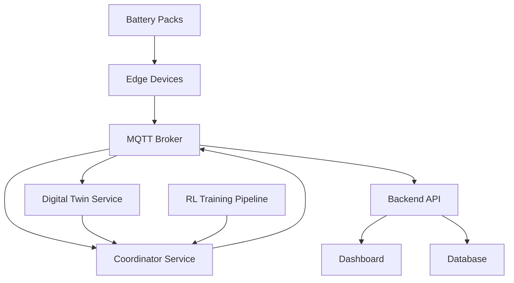

# PulseBMS Enhanced - System Architecture

## System Overview

PulseBMS Enhanced implements a distributed, multi-layered architecture designed for real-time optimization of second-life EV battery (SLB) fleets. The system combines edge computing, cloud services, and advanced algorithms to ensure safety, efficiency, and longevity.

## Component Architecture

### 1. Battery Packs Layer
- **Description**: Heterogeneous collection of retired EV battery packs
- **Characteristics**: Varying chemistries (LFP, NMC, etc.), degradation states, capacities
- **Interfaces**: CAN bus, battery sensors, safety relays

### 2. Edge Device Layer
- **Hardware**: RTOS-enabled microcontrollers (QNX, FreeRTOS)
- **Responsibilities**:
  - Real-time SoC/SoH estimation
  - Local safety monitoring and emergency shutoffs
  - RL policy execution for local optimization
  - MQTT telemetry streaming
- **Key Features**:
  - Low-latency response (<1ms for safety)
  - Offline operation capability
  - Hardware abstraction layer

### 3. Communication Layer
- **Protocol**: MQTT with QoS levels for different data types
- **Broker**: Eclipse Mosquitto or AWS IoT Core
- **Topics Structure**:
  ```
  pulsebms/{site_id}/{device_id}/telemetry
  pulsebms/{site_id}/{device_id}/commands
  pulsebms/{site_id}/coordinator/allocation
  ```

### 4. Cloud Services Layer

#### 4.1 Digital Twin Service
- **Framework**: PyBaMM for electrochemical modeling
- **Models**: P2D, SPM, equivalent circuit models
- **Capabilities**:
  - Real-time parameter estimation
  - Degradation forecasting (1-24 hour horizon)
  - Thermal and aging simulation

#### 4.2 Coordinator Service
- **Algorithms**: Model Predictive Control (MPC) + Safe Reinforcement Learning
- **Optimization Objectives**:
  - Minimize degradation cost
  - Meet power dispatch requirements
  - Respect safety constraints
  - Balance load across fleet

#### 4.3 Backend API
- **Framework**: FastAPI with async support
- **Database**: MongoDB for telemetry, PostgreSQL for configuration
- **Services**: Authentication, device management, data aggregation

### 5. Dashboard & Analytics Layer
- **Frontend**: React with real-time WebSocket connections
- **Visualization**: Chart.js, D3.js for advanced plots
- **AI Insights**: Integration with large language models for anomaly detection

## Data Flow Architecture



## Safety Architecture

### Multi-Level Safety System
1. **Hardware Level**: Physical relays and fuses
2. **Edge Level**: Real-time monitoring with <1ms response
3. **Cloud Level**: Fleet-wide anomaly detection
4. **Human Level**: Dashboard alerts and manual overrides

### Safety Constraints
- Voltage limits (per cell and pack)
- Current limits (charge/discharge)
- Temperature thresholds
- SoC operating windows
- Degradation rate limits

## Reinforcement Learning Architecture

### Safe RL Framework
- **Algorithm**: Constrained Policy Optimization (CPO) or Safe Actor-Critic
- **State Space**: SoC, SoH, temperature, load demand, degradation metrics
- **Action Space**: Charge/discharge power allocation per pack
- **Rewards**: Minimize cost while meeting demand and safety constraints

### Training Pipeline
1. **Simulation Environment**: PyBaMM-based battery fleet simulator
2. **Policy Network**: Deep neural network with safety layers
3. **Training**: Distributed training with experience replay
4. **Deployment**: Edge device inference with cloud model updates

## Scalability Considerations

### Horizontal Scaling
- Microservices architecture with container orchestration
- Load balancers for API endpoints
- Database sharding for large telemetry datasets

### Edge Scalability
- Hierarchical device management
- Local fleet coordination for reduced cloud dependency
- Mesh networking between edge devices

## Security Architecture

### Device Security
- Certificate-based MQTT authentication
- Encrypted communication channels
- Secure boot and firmware updates

### Cloud Security
- API rate limiting and authentication
- Role-based access control (RBAC)
- Data encryption at rest and in transit

## Performance Requirements

### Real-Time Constraints
- Edge safety response: <1ms
- Telemetry streaming: <100ms latency
- Optimization updates: <10 seconds
- Dashboard updates: <1 second

### Throughput Requirements
- 10,000+ devices per site
- 1Hz telemetry per device minimum
- 100MB/day data per device
- 99.9% uptime requirement

## Technology Stack

### Backend
- **Languages**: Python 3.11+, C++ for edge
- **Frameworks**: FastAPI, PyBaMM, PyTorch
- **Databases**: MongoDB, PostgreSQL, Redis
- **Message Broker**: Eclipse Mosquitto / AWS IoT

### Frontend
- **Framework**: React 18+ with TypeScript
- **State Management**: Redux Toolkit
- **Visualization**: Chart.js, Plotly.js
- **Real-time**: Socket.io

### Edge
- **RTOS**: QNX or FreeRTOS
- **Languages**: C/C++, MicroPython
- **Communication**: MQTT, CAN bus drivers
- **AI Runtime**: TensorFlow Lite, ONNX Runtime

### Infrastructure
- **Containers**: Docker, Kubernetes
- **Cloud**: AWS/Azure/GCP
- **CI/CD**: GitHub Actions, ArgoCD
- **Monitoring**: Prometheus, Grafana
