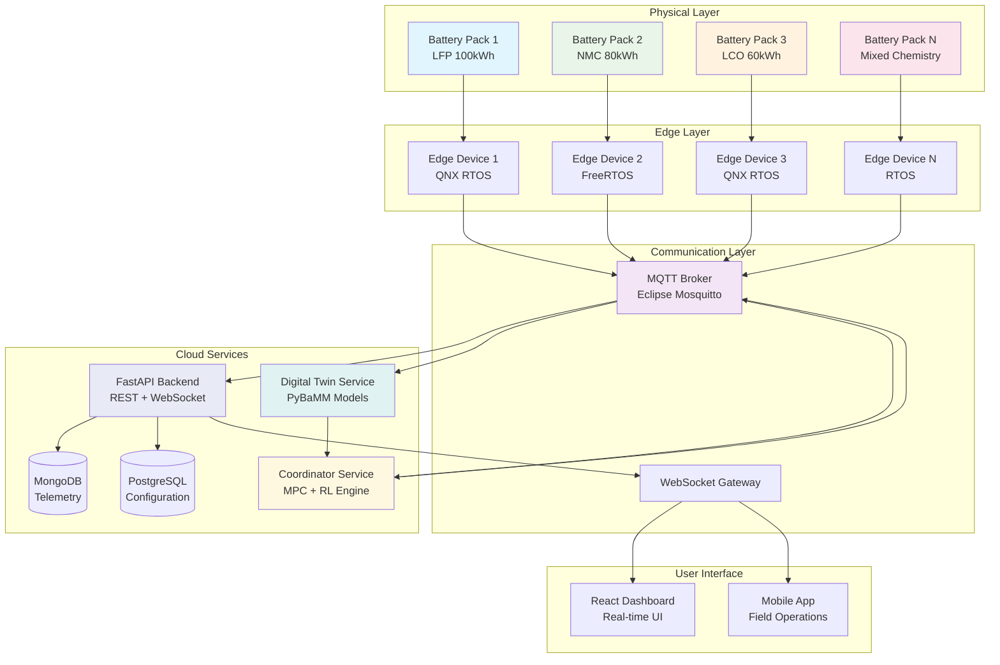
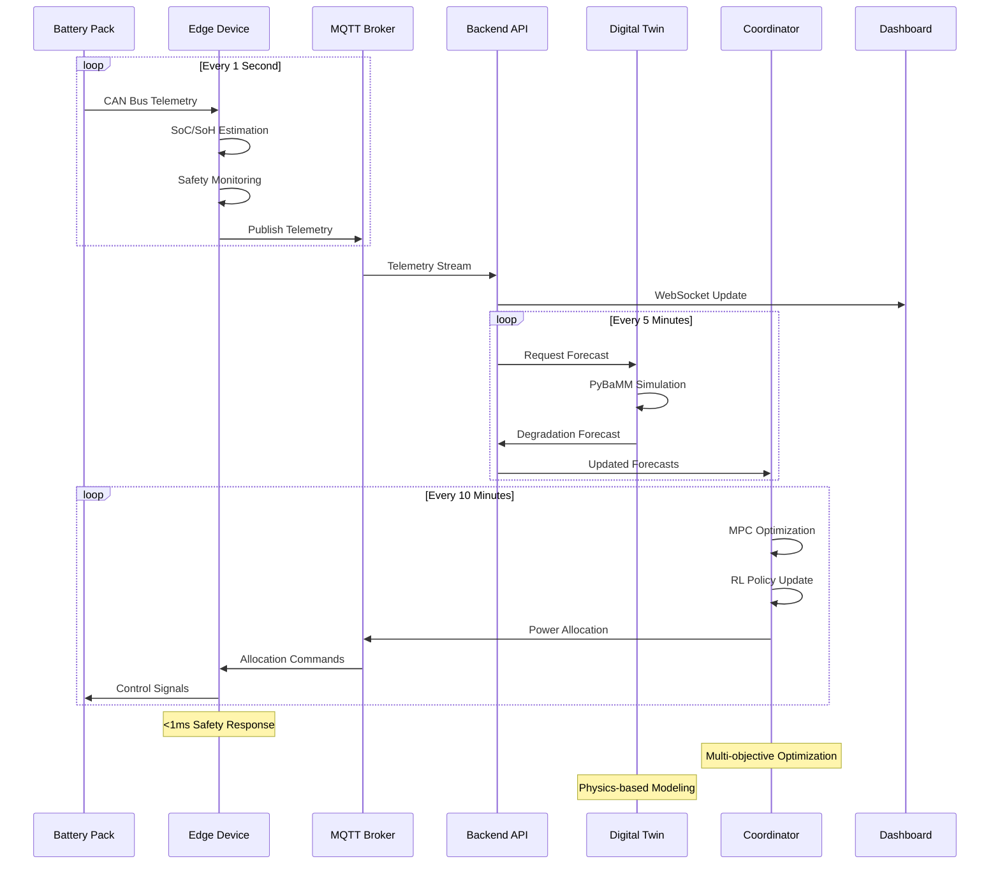
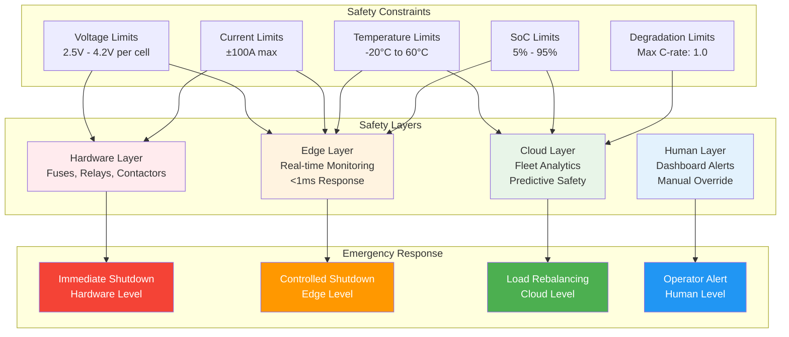
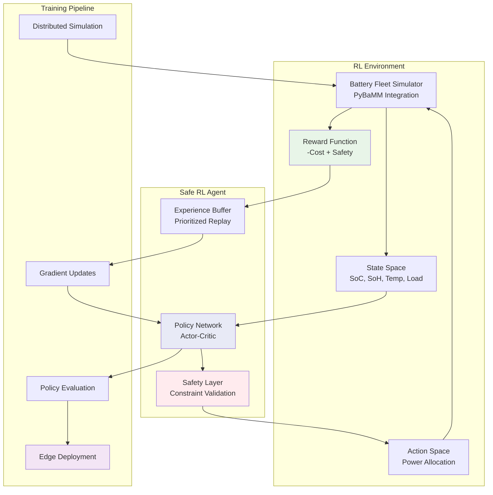
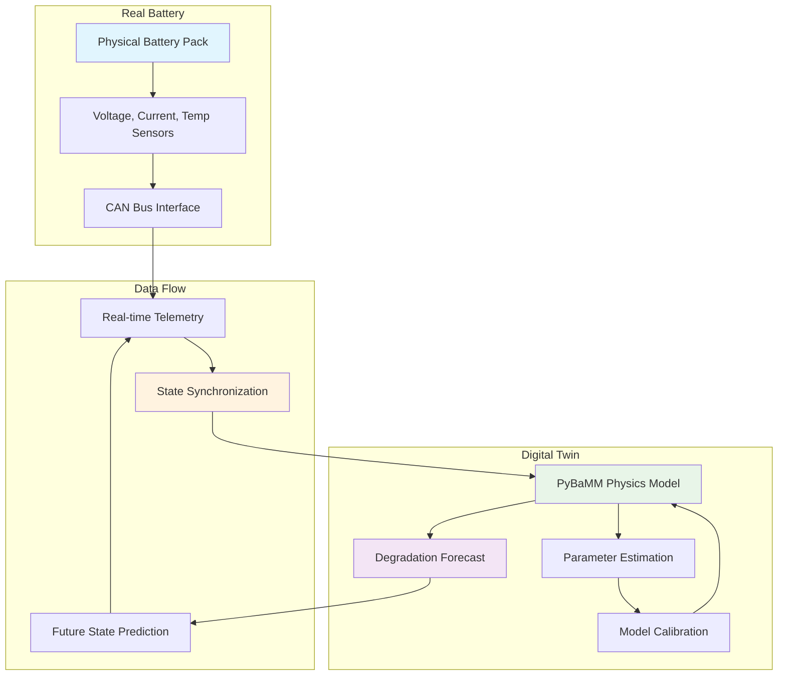
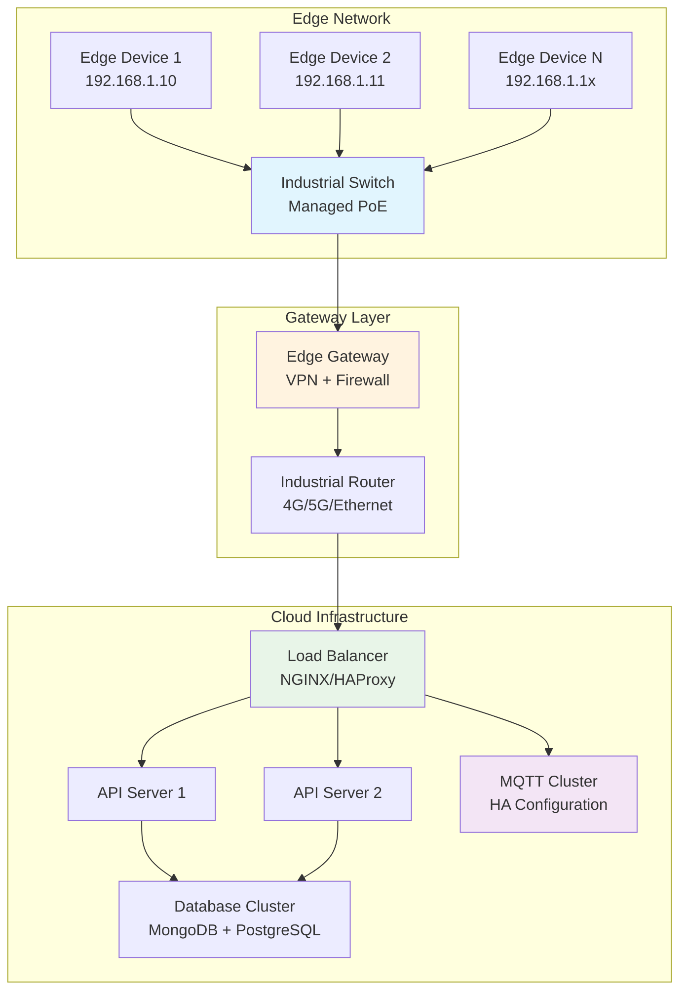
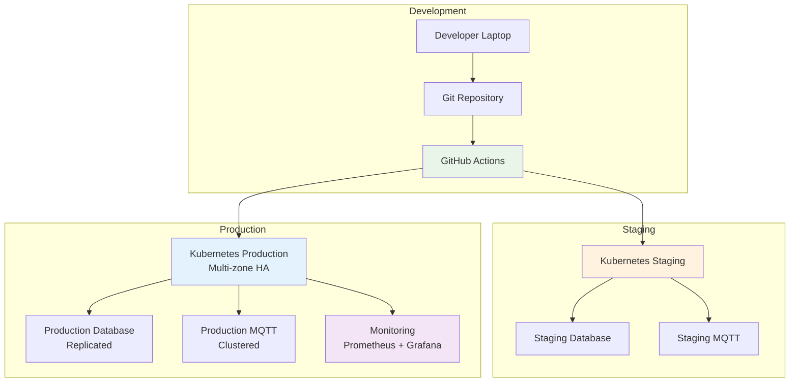

# PulseBMS Enhanced - System Diagrams

## System Architecture Overview



## Data Flow Architecture



## Safety Architecture Diagram



## MQTT Communication Schema

```mermaid
graph LR
    subgraph "Topic Hierarchy"
        ROOT[pulsebms/]
        SITE[{site_id}/]
        DEV[{device_id}/]
        COORD_PATH[coordinator/]
        
        ROOT --> SITE
        SITE --> DEV
        SITE --> COORD_PATH
    end
    
    subgraph "Message Types"
        TEL[telemetry]
        CMD[commands]
        ALLOC[allocation]
        STATUS[status]
        
        DEV --> TEL
        DEV --> CMD
        DEV --> STATUS
        COORD_PATH --> ALLOC
    end
    
    subgraph "QoS Levels"
        QOS0[QoS 0: Fire & Forget<br/>Status Updates]
        QOS1[QoS 1: At Least Once<br/>Telemetry Data]
        QOS2[QoS 2: Exactly Once<br/>Safety Commands]
    end
    
    TEL --> QOS1
    CMD --> QOS2
    ALLOC --> QOS1
    STATUS --> QOS0
    
    style ROOT fill:#e1f5fe
    style TEL fill:#e8f5e8
    style CMD fill:#fff3e0
    style ALLOC fill:#f3e5f5
    style QOS2 fill:#ffebee
```

## Reinforcement Learning Architecture



## Digital Twin Integration Flow



## Network Architecture



## Deployment Architecture


